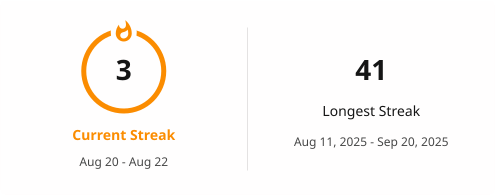

<h1 align="center">Bereket Honelign</h1>
<h3 align="center">Senior Full-Stack Developer · Backend Engineer · API & Microservices Architecture</h3>

  5+ years building robust, high-performance software across the full stack — 
  from distributed backend services to polished frontend interfaces.

---

### Focus areas

`Scalable Architecture` `Microservices` `API Design` `Performance Optimization` `Cloud Deployment` `CI/CD` `Team Leadership`

---

### Tech stack

| Frontend | Backend | Databases | Infra & DevOps |
|----------|---------|-----------|----------------|
| React, Vue.js, TypeScript, Tailwind CSS | Spring Boot, NestJS, Django, Laravel, Node.js | PostgreSQL, MySQL, MongoDB, Redis, MariaDB | AWS, Azure, GCP, Docker, Kubernetes, Jenkins, Kafka |

---

### GitHub Insights

  

  

---

### Get in touch

- 📧 **Email:** berekethonelign2@gmail.com
- 💼 **LinkedIn:** [bereket-honelign-330b55220](https://www.linkedin.com/in/bereket-honelign-330b55220)

---

### Ask me about

Full-stack system design · Microservices patterns · Performance optimization · Database architecture · Cloud & DevOps

---

> ⚡ **Fun fact:** I'm an unwavering optimist — always seeking the best solution, no matter how complex the problem.
