<h1 align="center">Bereket Honelign</h1>
<h3 align="center">Backend Engineer · Scalable APIs · Microservices & Cloud-Native Systems</h3>

  5+ years building robust, high-performance software — from distributed backend services 
  and REST APIs to polished full-stack interfaces.

  🔭 Building microservices with Spring Boot & NestJS · Open to backend & API engineering roles

  
  
  

---

### Featured projects

#### 🎨 Online Art Gallery
Full-stack art gallery platform with authenticated uploads, browsing, and role-based access.

[`Backend`](https://github.com/bereket-7/online-art-gallery-springboot) · [`Frontend`](https://github.com/bereket-7/vue-oag-frontend) · `Spring Boot` `Spring Security` `Vue.js`

#### 🔔 Novu + Spring Boot Integration
Notification infrastructure integration for Java backends using the open-source Novu platform.

[`Repository`](https://github.com/bereket-7/Novu-Spring-boot-Integration) · `Java` `Spring Boot` `Novu` `REST APIs`

#### 💳 PayGuard Microservices
Payment platform split into dedicated services for users and payment processing.

[`User Service`](https://github.com/bereket-7/payguard-user-service) · [`Payment Service`](https://github.com/bereket-7/payguard-payment-service) · `Java` `Microservices`

#### ⚡ Gin API Template
Production-ready Go REST API starter with clean project structure.

[`Repository`](https://github.com/bereket-7/gin-template) · `Go` `Gin` `REST`

---

### Focus areas

`Scalable Architecture` `Microservices` `API Design` `Performance Optimization` `Cloud Deployment` `CI/CD` `Team Leadership`

---

### Tech stack

| Primary | Also experienced |
|---------|------------------|
| Spring Boot, NestJS, Node.js, PostgreSQL, Redis, Docker, Kubernetes, AWS | React, Vue.js, Django, Laravel, MongoDB, Azure, GCP, Kafka, Jenkins |

---

### GitHub activity

  

  

---

### Ask me about

Full-stack system design · Microservices patterns · Performance optimization · Database architecture · Cloud & DevOps

---

> ⚡ **Fun fact:** I'm an unwavering optimist — always seeking the best solution, no matter how complex the problem.
